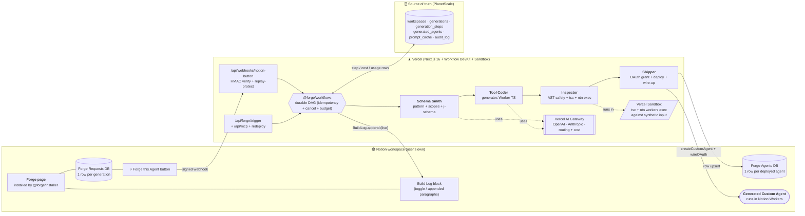
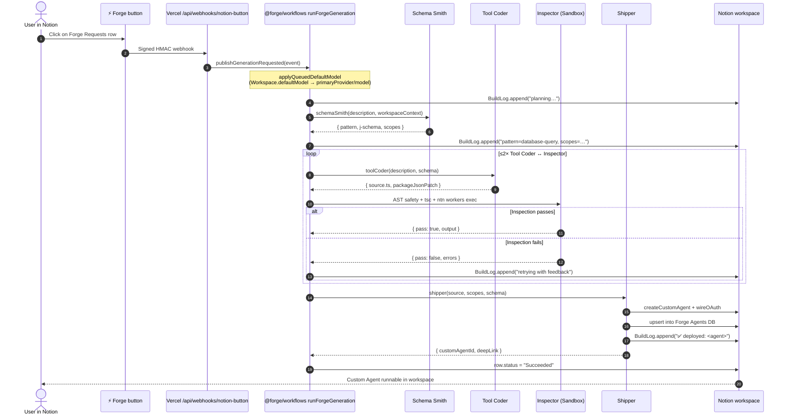

# Forge — Notion Custom Agent Studio

> **Describe an agent in plain English. Get a real, deployed Notion Custom Agent in 90 seconds — without ever leaving Notion.**

Forge is a Notion-native page that turns one sentence into a working, sandbox-validated, OAuth-wired Custom Agent in the user's own workspace. A manager-of-agents pipeline (Schema Smith → Tool Coder → Inspector → Shipper) generates TypeScript, runs `tsc` and `ntn workers exec` against synthetic input inside a Vercel Sandbox, and only then promotes the deploy. No editor. No terminal. No git.

---

## Why this is the best use of Notion in the hackathon

We treat Notion as the **entire surface area** — input, output, runtime, control plane, and observability all live in the user's workspace. Every interaction a user has with Forge happens on a Notion page they already know how to use; every artifact Forge produces is a first-class Notion object.

| Notion surface                  | How Forge uses it                                                                                                              |
| ------------------------------- | ------------------------------------------------------------------------------------------------------------------------------ |
| **Custom Agents (Workers)**     | Generated agent is deployed via `ntn workers exec` and lives in the user's workspace as a real Notion Custom Agent             |
| **OAuth + integration install** | Notion → Clerk OAuth proxy auto-binds the workspace; per-agent OAuth scopes are derived by Schema Smith and granted on install |
| **Pages API**                   | Idempotent installer creates the **Forge** page in a parent the user picks during onboarding                                   |
| **Blocks API**                  | Build Log streams live progress lines as paragraph blocks appended into a toggle, one per pipeline step                        |
| **Databases API**               | Installer provisions **Forge Requests**, **Forge Agents**, and (optional) **Forge Operations** DBs with full property schemas  |
| **Button webhook**              | `⚡ Forge this Agent` button on each Forge Requests row triggers a signed HMAC webhook → starts the workflow                   |
| **Datasources / `query`**       | Schema Smith reads the user's existing DBs + agents via `ntn datasources query` to ground the schema it emits                  |
| **Comments API**                | When Schema Smith returns `pattern: null` (ambiguous), Forge posts a clarification comment on the Forge Requests row           |
| **Runs API**                    | Per-agent dashboard fetches real `listRuns` + `getRunLogs` output with cursor pagination                                       |
| **`ntn` CLI (typed wrapper)**   | `@forge/ntn-wrapper` exposes audit-logged, type-safe access to workers / oauth / pages / webhooks / sync / files               |

**Net effect:** a user installs Forge once, never opens another tab, and ships a real Custom Agent that runs in Notion's own runtime — alongside the very page they used to describe it.

---

## The 30-second pitch

- **One sentence in.** "Every morning, summarize yesterday's `Tasks` into a `Daily Digest` row."
- **One click.** The ⚡ Forge button on the Forge Requests row fires a signed webhook into Vercel.
- **Manager-of-agents pipeline.** Four sub-agents (Schema Smith → Tool Coder → Inspector → Shipper) generate TypeScript, validate it with AST safety + `tsc`, then _actually execute_ it in a Vercel Sandbox against synthetic input before promotion.
- **One real Custom Agent out.** Deployed by Shipper to the user's workspace via the Notion Custom Agent REST API. Build Log streams every step live as Notion blocks. Failed generations never reach the user.

---

## What it does

Forge constrains code-gen to **five tool patterns** so output is reliable. Each pattern is parameterized by Schema Smith, not freeform LLM output.

| Pattern             | One-line                                          | Example prompt                                                                  |
| ------------------- | ------------------------------------------------- | ------------------------------------------------------------------------------- |
| `database-query`    | Reads/writes a Notion DB on a schedule or trigger | "Every morning, summarize yesterday's `Tasks` into a `Daily Digest` row."       |
| `webhook-trigger`   | External webhook → Notion row                     | "When a Stripe charge succeeds, append a row to my `Revenue` DB."               |
| `sync-source`       | Polls a third-party API → Notion DB               | "Pull my open Linear bugs every hour into `Bug Triage`, sorted by severity."    |
| `external-api-call` | Notion-triggered call to a third-party API        | "When I flip `Status` to `Refund`, refund the Stripe charge linked on the row." |
| `multi-step`        | Chains 2–3 of the above with intermediate state   | "On a new GitHub issue, summarize, label, and assign — then mirror to Notion."  |

The list of supported patterns lives in [`PLAN.md` §4.1](PLAN.md#41-schema-smith); changes to it are gated by the Promptfoo eval suite.

---

## Architecture



See [`docs/architecture.md`](docs/architecture.md) for the full request flow, sub-agent responsibilities, data model, and failure modes.

### The live request flow



Notice what the user sees: **one click, one Build Log streaming inside Notion, one deployed agent that lives in the same workspace.** They never leave the page they typed the description on.

---

## Tech stack (sponsor mapping)

Every sponsor is load-bearing. None are decorative.

| Sponsor                         | Role in Forge                                                                                                                                                                                                                             | Where                                                            |
| ------------------------------- | ----------------------------------------------------------------------------------------------------------------------------------------------------------------------------------------------------------------------------------------- | ---------------------------------------------------------------- |
| **Notion Developer Platform**   | 10+ surfaces — see [table above](#why-this-is-the-best-use-of-notion-in-the-hackathon). `Notion-Version` header pinned to `2026-03-11` per [docs.notion.com](https://docs.notion.com/).                                                   | `@forge/notion-client`, `@forge/ntn-wrapper`, `@forge/installer` |
| **OpenAI (GPT-5.5)**            | Default primary model for Schema Smith + Tool Coder (`gpt-5.5`); OpenAI fallback (`gpt-5.4-mini`); `text-embedding-3-large` for the prompt-similarity cache. Per-workspace override picker in `/settings` (auto / GPT-5.5 / mini / Opus). | `@forge/agents`, `@forge/db/prompt-cache`, via Vercel AI Gateway |
| **Anthropic Claude (Opus 4.7)** | Opt-in primary via `FORGE_PRIMARY_PROVIDER=anthropic` or per-workspace `defaultModel=claude-opus-4-7`. Keeps the cached Anthropic system-prompt path warm for deployments with credits.                                                   | `@forge/agents`, via Vercel AI Gateway                           |
| **Vercel**                      | Hosting (Next.js 16 + API routes), **AI Gateway** (multi-model + cost tracking), **Workflow DevKit** (durable DAG with idempotency + cancellation + cost-budget), **Sandbox** (`tsc` + `ntn workers exec`), **Blob**, **Edge Config**.    | `apps/web`, `@forge/workflows`, `vercel.json`                    |
| **PlanetScale** (Postgres)      | Source of truth: workspaces (incl. `defaultModel`), generations, **per-step token + cost rows**, agents, prompt cache, audit log, usage meter. Branch-per-PR for migrations.                                                              | `@forge/db` (Prisma schema)                                      |
| **MiniMax**                     | Voice-to-text for "describe an agent by voice" input; image gen for per-agent avatars stored on each `GeneratedAgent`.                                                                                                                    | `apps/web/lib/multimodal/*`                                      |
| **Clerk**                       | Auth: Notion OAuth proxy + JWT issued to the dashboard. Workspace bind in middleware.                                                                                                                                                     | `apps/web/proxy.ts`, `apps/web/lib/auth.ts`                      |

Secondary infra (Upstash rate-limit, Sentry, PostHog, Resend, shadcn/ui, Promptfoo, Playwright) is documented in [`PLAN.md` Part II](PLAN.md#part-ii--tech-stack-with-sponsor-mapping).

---

## What's actually wired (not just documented)

Concrete capabilities, end-to-end:

- ✅ **Workspace `defaultModel` selector** — `/settings` dropdown writes `Workspace.defaultModel` (Prisma TEXT column, defaults `'auto'`); every entry route (forge/trigger, webhook, MCP, redeploy) snapshots it into `GenerationRequestedEvent`; `applyQueuedDefaultModel` overrides `SubAgentConfig.primaryProvider` + `primaryModel` per run on both the Vercel WDK and Inngest runners.
- ✅ **Per-step token + cost capture** — every sub-agent emits a `<agent>.complete` log event; the orchestrator's `createSubAgentTrace` captures prompt/completion/cache tokens + `costUsd` and persists them on `GenerationStep` rows; the workflow accumulates `totalCostUsd` and enforces `totalCostBudgetUsd` between durable step boundaries.
- ✅ **Inspector-gated promotion** — the generated Worker is AST-scanned, type-checked, and **actually executed** in a Vercel Sandbox against synthetic input from the j-schema before Shipper is allowed to run.
- ✅ **Provider failover** — RateLimit / 5xx / network errors from the primary trip a fallback to the OpenAI fallback model via the AI Gateway; auth failures (401/403) fail fast.
- ✅ **Forge Operations DB** (optional) — when `FORGE_OPS_NOTION_DB_ID` + token are set, the workflow publishes one row per terminal generation (succeeded / failed / cancelled / cached / needs_clarification) into a self-monitoring Notion DB. Forge monitors itself in Notion.
- ✅ **MCP server** — `packages/mcp-server` exposes `forge_agent` so Claude Code / Cursor / ChatGPT can drive the pipeline.
- ✅ **CI gates** — typecheck + lint + 400+ tests + Promptfoo eval dry-run on every PR; nightly real-API eval sweep; live E2E job on `deploy-prod` when `FORGE_E2E_CLERK_SESSION` is configured.

---

## Quickstart

### Prerequisites

- Node.js **20+** — `nvm use` picks up `.nvmrc`
- pnpm **9+** — `corepack enable && corepack prepare pnpm@9 --activate`
- The Notion `ntn` CLI — `curl -fsSL https://ntn.dev | bash`

### Setup

```bash
git clone https://github.com/nihalnihalani/forge.git
cd forge
bash scripts/setup.sh
```

`scripts/setup.sh` verifies Node + pnpm + `ntn` versions, copies `.env.example` → `.env`, installs workspace dependencies, and runs `ntn doctor`.

### Fill in `.env`, then validate

```bash
pnpm verify:env
```

The schema in [`scripts/verify-env.ts`](scripts/verify-env.ts) enforces shape correctness on every required key. `FORGE_PRIMARY_PROVIDER=openai` is the default — `ANTHROPIC_API_KEY` becomes optional unless you set it to `anthropic`.

### Run the dev stack

```bash
./run.sh dev
```

`run.sh` creates a timestamped log under `logs/`, verifies prerequisites, loads `.env`, and can run local checks with CI-shaped stub values:

```bash
./run.sh check --ci-env
./run.sh dev --debug
```

The Next.js dashboard comes up on `http://localhost:3000`. Sign in with Notion → the installer creates the **Forge** page + **Forge Requests** DB in your workspace → describe an agent → click **⚡ Forge this Agent** → watch the Build Log.

### Vercel deployment note

This is a pnpm + Turborepo monorepo. The Next.js app lives at `apps/web`, so the Vercel project's **Root Directory** must be set to `apps/web` (Project → Settings → General → Root Directory). `vercel.json` declares `framework: nextjs` and the deploy region but cannot set the Root Directory — that is a dashboard-only setting.

---

## Repo tour

| Path                                                 | What lives here                                                                                                                             |
| ---------------------------------------------------- | ------------------------------------------------------------------------------------------------------------------------------------------- |
| [`apps/web/`](apps/web/)                             | Next.js 16 dashboard + every `/api/*` route, Clerk middleware (`proxy.ts`), the Notion-button webhook                                       |
| [`packages/agents/`](packages/agents/)               | The four sub-agents (Schema Smith, Tool Coder, Inspector, Shipper) + shared types, model defaults, pricing helpers                          |
| [`packages/ntn-wrapper/`](packages/ntn-wrapper/)     | Typed, audit-logged wrapper around the `ntn` CLI — workers, oauth, pages, webhooks, sync, files                                             |
| [`packages/notion-client/`](packages/notion-client/) | Typed Notion REST wrapper for studio-side ops the CLI doesn't cover ergonomically                                                           |
| [`packages/connectors/`](packages/connectors/)       | First-party connector SDKs (GitHub, Linear, Stripe, Slack, Google, Sentry, Vercel, Anthropic, OpenAI, MiniMax) imported by generated agents |
| [`packages/workflows/`](packages/workflows/)         | Vercel Workflow DevKit DAG that sequences the sub-agents with retries, cancellation, idempotency, cost budget, and `defaultModel` routing   |
| [`packages/db/`](packages/db/)                       | Prisma schema (incl. `Workspace.defaultModel`) + Node and Edge clients + repositories + append-only audit log                               |
| [`packages/safety/`](packages/safety/)               | AST scanner + forbidden-API check + `package.json` dep allowlist + `j` schema validator                                                     |
| [`packages/installer/`](packages/installer/)         | Idempotent bootstrap of the Forge page + Forge Requests DB + Build Log block + ⚡ button webhook in a fresh workspace                       |
| [`packages/mcp-server/`](packages/mcp-server/)       | Forge as an MCP server (`forge_agent` tool) — drive Forge from Claude Code, Cursor, ChatGPT                                                 |
| [`packages/eval-harness/`](packages/eval-harness/)   | Promptfoo configs + golden inputs per sub-agent; CI dry-run + nightly real-API sweep                                                        |
| [`scripts/`](scripts/)                               | `setup.sh`, env verifier, prompt-cache priming                                                                                              |
| [`e2e/`](e2e/)                                       | Playwright happy-path tests                                                                                                                 |

---

## How we got here

This repo includes the unedited debate trail that led to Forge winning over 20+ candidate ideas. The product brief is in [`PLAN.md`](PLAN.md); everything else is exposition.

- [**PLAN.md**](PLAN.md) — production plan: agent team, architecture, every `ntn` CLI surface used, sponsor mapping, data model, code-gen safety, pitch script, Q&A, prod readiness checklist
- [**IDEAS.md**](IDEAS.md) — full pool of 20+ candidates with elimination notes
- [**DEBATE.md**](DEBATE.md) — multi-round Builder vs Devil's Advocate transcript
- [**RESEARCH.md**](RESEARCH.md) — raw findings: platform deep-dive, judge intel, shareable launch shapes, /last30days trends, platform sharp edges
- [**docs/architecture.md**](docs/architecture.md) — request flow, sub-agent responsibilities, data flow
- [**docs/api.md**](docs/api.md) — HTTP API reference
- [**docs/CI_CD.md**](docs/CI_CD.md) — pipeline + how to add a sub-agent eval

---

## Hackathon submission

- **Event:** [Notion Developer Platform Hackathon](https://cerebralvalley.ai/e/notion-developer-platform-hackathon/), Notion HQ, May 16–17, 2026
- **Themes:** Workflow Relay (primary) + Autonomous Sidekick (secondary)
- **Submission:** [Cerebral Valley form](https://cerebralvalley.ai/e/notion-developer-platform-hackathon/hackathon/submit)
- **License:** MIT
- **All work in this repo:** started during the event (per hackathon rules)

---

## Contributing

PRs welcome — see [`CONTRIBUTING.md`](CONTRIBUTING.md) for dev setup, branch/commit conventions, the test-typecheck-lint gate, and how to add a new agent pattern or connector. All contributors must follow the [Code of Conduct](CODE_OF_CONDUCT.md). For security issues, see [`SECURITY.md`](SECURITY.md).

---

## License

[MIT](LICENSE) © 2026 Nihal Nihalani, Charlie Gillet, Yahya.

---

## Team

- **Nihal Nihalani** — [@nihalnihalani](https://github.com/nihalnihalani)
- **Charlie Gillet** — [@charliegillet](https://github.com/charliegillet)
- **Yahya** — [@yhinai](https://github.com/yhinai)

---

## Acknowledgments

Thanks to **Notion** for building the Developer Platform and hosting the hackathon, and to the sponsors who make this stack possible: **OpenAI**, **Anthropic**, **Vercel**, **PlanetScale**, **MiniMax**, **Clerk**, **Sentry**, **PostHog**, **Resend**, and **Upstash**. Special thanks to the Notion engineers who walked us through the `ntn` CLI sharp edges (logged in [`RESEARCH.md`](RESEARCH.md)).
